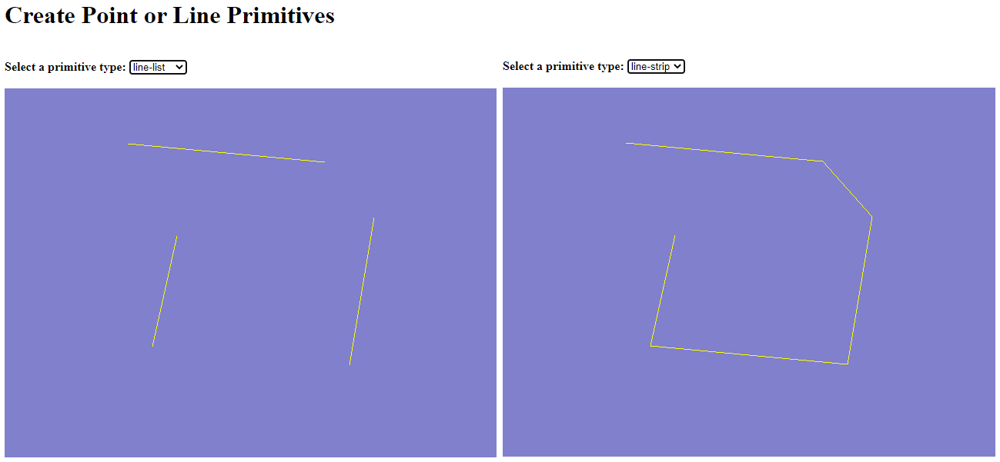

# Step-by-Step WebGPU Graphics Programming (5) 
## WebGPU Primitives: Points and Lines

This is the source code for the fifth part of a series YouTube videos on step-by-step WebGPU graphics programming.

This sample WebGPU app shows how to create point and line primitives. The output from the app is shown in the following image.

## Link for All Source Code Used in the WebGPU Step-By-Step Video Series:

https://github.com/jack1232/WebGPU-Step-By-Step